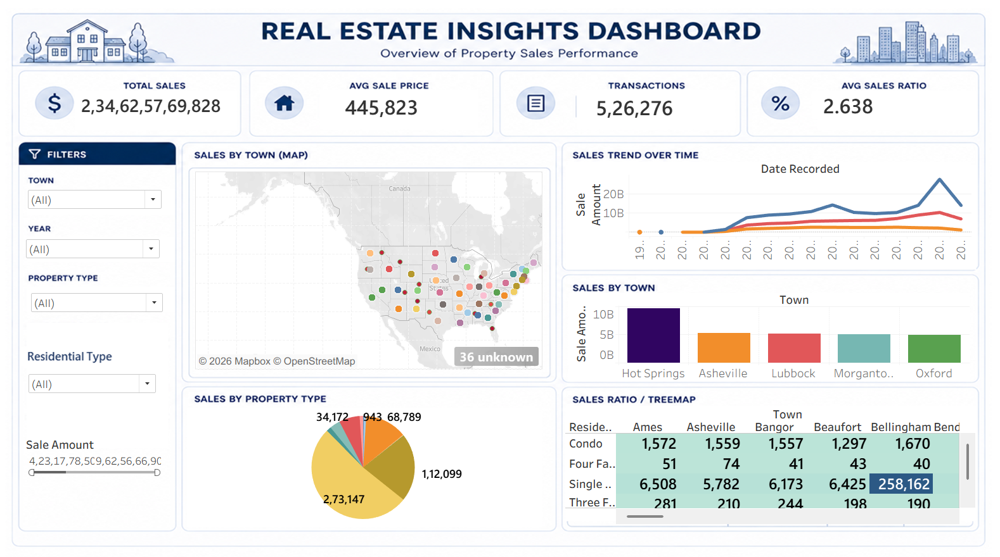

# 🏠 Real Estate Insights Dashboard | Tableau

An interactive **Real Estate Insights Dashboard** developed in **Tableau Public** to analyze property sales, market trends, town-level performance, property types, and residential categories.

The project transforms real estate sales data into an interactive business intelligence dashboard that helps users understand **where sales are strongest, how the market is trending, and which property types dominate the market**.

---

## 📌 Project Overview

The objective of this project is to analyze real estate sales data from **2011 to 2022** and provide meaningful business insights through interactive data visualization.

The dashboard combines:

* KPI Cards
* Interactive Filters
* Geographic Maps
* Sales Trend Analysis
* Town-Level Sales Analysis
* Property Type Analysis
* Residential Type Analysis
* Sales Ratio Analysis

The final dashboard allows users to explore the real estate market from **overall, geographic, and property-level perspectives**.

---

## 🎯 Business Objective

The main objective is to understand:

1. Overall real estate market performance
2. Sales trends between 2011 and 2022
3. High-performing towns
4. Dominant property types
5. Average sale values
6. Differences in sales ratios across towns
7. Geographic and residential market patterns

---

## ❓ Business Questions

### Question 1 — Market Overview

**What is the overall condition and trend of the real estate market?**

The dashboard shows a positive sales trend over the analyzed period, while the average sale amount remains relatively low.

### Question 2 — Geographic Performance

**Which towns are performing strongly?**

Fort Collins is identified as a strong-performing town based on overall sales performance.

### Question 3 — Property Market

**Which property types dominate the market?**

Single Family properties are the dominant property type in the dataset.

---

# 📊 Dashboard Overview

## 1️⃣ KPI Cards

The dashboard contains key performance indicators:

* **Total Sales**
* **Average Sale Price**
* **Total Transactions**
* **Average Sales Ratio**

These KPIs provide a quick overview of the overall market.

---

## 2️⃣ Sales by Town — Map

The map provides a geographic view of property sales.

Users can explore different towns and identify areas with stronger sales activity.

### Interactive Feature

Selecting a town can be used to interact with other dashboard visuals through Tableau dashboard actions.

---

## 3️⃣ Sales Trend Over Time

A line chart is used to analyze sales performance over time.

### Period Covered

**2011–2022**

### Insight

The overall sales trend shows a **positive movement**, although average sale values remain relatively low.

---

## 4️⃣ Sales by Town

A bar chart compares total sales across different towns.

### Key Insight

**Fort Collins** is identified as one of the strongest-performing towns based on overall sales performance.

---

## 5️⃣ Sales by Property Type

A chart displays the distribution of sales across property types.

### Key Insight

**Single Family** properties dominate the market, with a total sale amount of approximately:

**2,731,147**

---

## 6️⃣ Residential Type Analysis

A treemap is used to compare residential property categories across different towns.

This helps identify:

* Dominant residential categories
* Town-level differences
* High-volume residential segments

---

# 🔑 Key Business Insights

### 1. Highest Total Sales

The highest total sales are concentrated in **Fort Collins**.

### 2. Sales Trend

The overall sales trend shows a **positive trend between 2011 and 2022**.

### 3. Dominant Property Type

**Single Family** is the most common and dominant property type.

### 4. Highest Average Sale Value

The highest average sale value is observed in **Hot Springs**, at approximately **9,179.54**.

### 5. Sales Ratio Performance

**Bellingham** has the highest sales ratio, indicating stronger sales performance, while **Asheville** has the lowest sales ratio, indicating relatively weaker performance.

---

# 🎛️ Dashboard Interactivity

The dashboard includes interactive controls such as:

### Filters

* Town
* Year
* Property Type
* Residential Type
* Sale Amount

### Dashboard Actions

#### Filter Action

Selecting a town can filter related dashboard visuals.

Example:

**Select a Town → Related charts update**

#### Highlight Action

Selecting a town can highlight related marks across dashboard visualizations.

#### URL Action

A dynamic URL action can be used to open an external webpage based on the selected town.

Example:

**Town → Wikipedia / Real Estate Information**

---

# 📖 Storytelling

The project is organized into three major story points.

## Story 1 — Market Overview

### Contains

* KPI Cards
* Sales Trend
* Property Distribution

### Business Question

> What is the overall condition and trend of the real estate market?

---

## Story 2 — Geographic Performance

### Contains

* Geographic Map
* Sales by Town
* Average Sale Amount by Town

### Business Question

> Which towns are performing strongly?

---

## Story 3 — Property Market

### Contains

* Property Type Distribution
* Residential Type Treemap
* Average Sale Amount

### Business Question

> Which property types dominate the market?

---

# 🛠️ Tools & Technologies

| Tool                  | Purpose                               |
| --------------------- | ------------------------------------- |
| **Tableau Public**    | Dashboard development & visualization |
| **Microsoft Excel**   | Data preparation & exploration        |
| **Maps**              | Geographic analysis                   |
| **Calculated Fields** | Business metrics                      |
| **Parameters**        | Interactive metric selection          |
| **Dashboard Actions** | Filter, Highlight & URL interactions  |

---

# 📐 Calculated Metrics

Some of the key metrics used in the dashboard include:

### Total Sales

```text
SUM([Sale Amount])
```

### Average Sale Amount

```text
AVG([Sale Amount])
```

### Property Count

```text
COUNT([Property ID])
```

These calculations support KPI cards and analytical visualizations.

---

# 🎨 Visualizations Used

The project includes multiple visualization techniques:

* KPI Cards
* Bar Charts
* Line Charts
* Pie Charts
* Treemaps
* Geographic Maps
* Tables
* Interactive Filters
* Parameters
* Dashboard Actions

---

# 📂 Project Structure

```text
Real-Estate-Insights-Dashboard/
│
├── README.md
│
├── Data/
│   └── Real_Estate_Sales_2011-2022.xlsx
│
├── Dashboard/
│   └── Real_Estate_Insights_Dashboard.twbx
│
├── Images/
│   └── real-estate-dashboard.png
│
├── Documentation/
│   ├── Business_Questions.md
│   └── Key_Insights.md
│
└── LICENSE
```

> **Note:** Add your actual Tableau workbook and dataset files to these folders. If the dataset is too large or cannot be publicly shared, upload only a sample or provide the source/reference instead.

---

# 🚀 Project Workflow

The project was completed using the following analytical process:

### Step 1 — Data Preparation & Exploration

* Connected the real estate dataset
* Reviewed fields and data types
* Checked missing values
* Checked geographic fields
* Prepared data for visualization

### Step 2 — Visual Exploration

Created initial visualizations to understand:

* Sales distribution
* Property types
* Town performance
* Sales trends

### Step 3 — Mapping & Time Analysis

Created:

* Geographic sales map
* Sales trend over time
* Town-level analysis

### Step 4 — Calculated Fields & Parameters

Created calculated metrics such as:

* Total Sales
* Average Sale Amount
* Property Count

Used parameters for interactive metric selection.

### Step 5 — Dashboard Design

Combined visualizations into an interactive dashboard containing:

* KPI section
* Filters
* Map
* Trend chart
* Town analysis
* Property analysis
* Treemap

### Step 6 — Storytelling & Publishing

Created three story points:

1. Market Overview
2. Geographic Performance
3. Property Market

Published the final dashboard using Tableau Public.

---

# 📸 Dashboard Preview

Add your dashboard screenshot here:

```markdown

```

---

# 🌐 Tableau Public

**Live Dashboard:**
Add your Tableau Public dashboard link here.

```text
https://public.tableau.com/
```

Replace the above with your actual published workbook URL.

---

# 💡 Business Recommendations

Based on the analysis:

### 1. Focus on High-Performing Towns

Areas such as **Fort Collins** should receive additional attention because of their strong sales performance.

### 2. Analyze Low Average Sale Values

Although the overall sales trend is positive, the relatively low average sale amount suggests that transaction volume and transaction value should be analyzed separately.

### 3. Understand Single Family Demand

Since **Single Family** properties dominate the market, businesses can investigate demand, pricing, and inventory patterns within this segment.

### 4. Investigate Sales Ratio Differences

The difference between **Bellingham** and **Asheville** indicates that geographic factors may have an important effect on sales performance.

---

# 📈 Future Improvements

Possible future improvements include:

* Add year-over-year growth analysis
* Add Top 5 / Bottom 5 town analysis
* Add dynamic parameter-based KPI selection
* Add price segmentation
* Add predictive sales analysis
* Add forecasting
* Add advanced geographic analysis
* Add market growth indicators
* Improve mobile dashboard layout

---

# 🎓 Project Type

**Data Analytics | Business Intelligence | Data Visualization | Real Estate Analytics**

---

# 👨‍💻 Author

**Vikash Rao**

### Skills Demonstrated

* Tableau
* Data Visualization
* Business Analysis
* Dashboard Design
* Data Cleaning
* Exploratory Data Analysis
* KPI Development
* Interactive Analytics
* Business Storytelling

---

# ⭐ Project Highlights

✔ Interactive Tableau Dashboard
✔ Real Estate Sales Analysis
✔ Geographic Performance Analysis
✔ Time-Series Analysis
✔ Property Type Analysis
✔ KPI Cards
✔ Interactive Filters
✔ Dashboard Actions
✔ Business Insights
✔ Storytelling Dashboard

---

## 📌 Conclusion

The **Real Estate Insights Dashboard** converts raw property sales data into an interactive analytical solution.

The dashboard highlights overall market trends, town-level performance, property type dominance, average sale values, and sales ratio differences.

The analysis indicates a **positive overall sales trend**, strong performance in selected towns, and a clear dominance of **Single Family properties**, while differences in average sale values and sales ratios provide opportunities for deeper market analysis.

---

**Built with Tableau Public 📊 | Real Estate Analytics 🏠 | Business Intelligence 💼**
